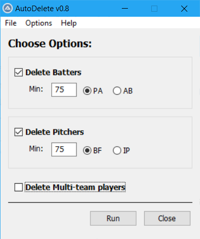
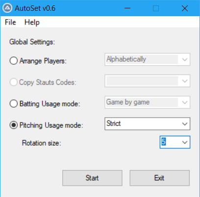
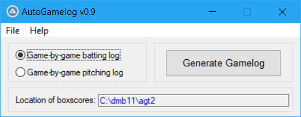

## Additional automation tools for Diamond mind Baseball
[AutoIt](https://www.autoitscript.com/site/) scripts that automate the tedious button mashing required to perform some common tasks with [Diamond Mind Baseball](http://www.diamond-mind.com/)

### AutoDelete
Automates player deletion from **Organizer**.  Will delete players below specified AB, PA, IP or BF threshold.

### AutoSetUsage
Automates bulk settings changes to manager profiles for all teams from **Team roster**.  Sets batter and pitcher usage modes and player sort order.

### AutoGamelog
Parse DMB boxscores (expanded style) to extract player gamelogs for pitchers or batters.  Outputs to csv file.

### AutoModifyShortName
Automates player modification from **Organzer**.  Changes player short names to "Lastname,F" format.

 
January 20, 2019